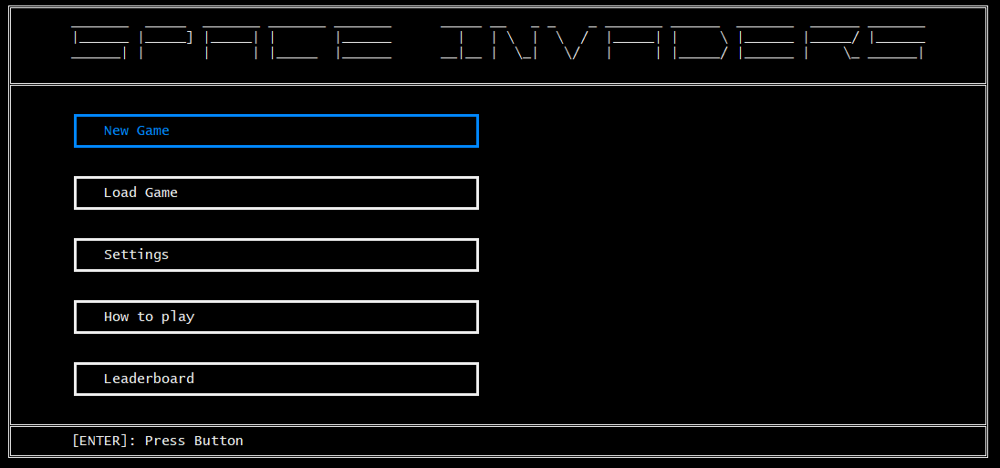
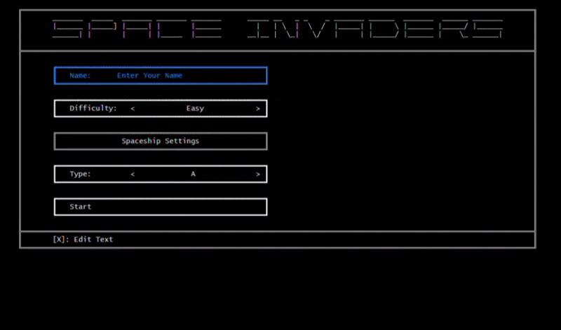
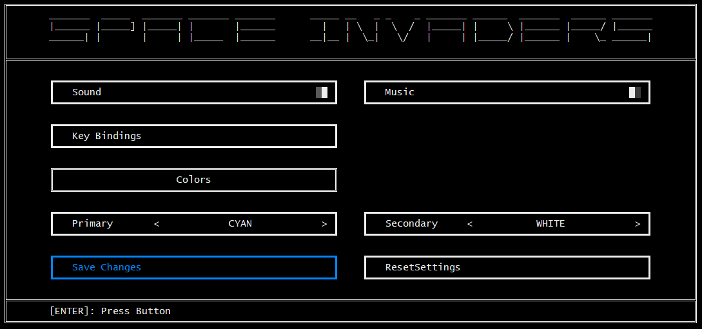

# Space Invaders

A terminal-based Space Invaders clone written in procedural C++ for the Windows console. Everything is rendered with Unicode box-drawing characters and ANSI colors, and the project ships with a reusable form engine, settings, save/load, and a persistent leaderboard.

## Features

- Three enemy types with distinct sprites, health, and score values
- Two-frame enemy animation synced to movement
- Destructible cover walls that absorb bullet damage
- A bonus UFO that periodically crosses the top of the screen
- Difficulty presets (Easy / Medium / Hard) plus a Custom mode
- Save / Load of game state via binary serialization
- Persistent leaderboard, sorted by score
- Settings menu with:
  - Toggleable music and sound effects
  - Selectable primary / secondary UI colors
  - Remappable key bindings (Player 1 and Player 2)
- Pause menu accessible mid-game
- A generic form engine (buttons, textboxes, checkboxes, selectboxes, rangebars, tables, keyboxes, labels, message boxes)

## Requirements

- **OS:** Windows (uses the Win32 console API and MCI for audio)
- **Compiler:** MinGW g++ with C++14 support
- **Font:** a font with good Unicode / box-drawing coverage (Consolas works)

## Build

From a Windows command prompt or Git Bash:

    cd src
    compile.cmd

Or manually:

    c++ -std=c++14 utilities.cpp form.cpp audio.cpp settings.cpp leaderboard.cpp menu.cpp game.cpp -lwinmm -o a.exe

The executable is created inside the `src/` folder.

## Run

Run it from the `src/` directory so the game can find its audio and data files:

    cd src
    a.exe

If glyphs render as boxes, set the console font to one with full Unicode coverage and make sure the console uses UTF-8 (`chcp 65001`).

## Controls

**Menus**

- `W A S D` — navigate
- `Enter` — select / confirm
- `X` — activate (toggle, edit, increase)
- `Z` — alternate action (decrease, previous option)
- `Esc` — back / close

**In game**

- `A` / `D` — move ship
- `Space` — shoot
- `Esc` — pause

All gameplay keys are remappable in Settings → Key Bindings.

## Screenshots

**Gameplay**

**Settings**

## Project layout

    src/
      utilities.*     console helpers (cursor, input, ANSI colors)
      color.h         ANSI color constants
      form.*          generic form / UI engine
      Audio.*         sound effects + background music (MCI)
      Settings.*      persistent settings and key bindings
      Leaderboard.*   score persistence and ranking
      game.*          core game logic, enemies, bullets, collision
      Menu.cpp        menu screens and main()
      *.wav           audio assets
    docs/             screenshots and recordings

## Current state & limitations

Honest status of the project:

- Windows-only (depends on Win32 console APIs and MCI audio)
- Single-player only; Player 2 key bindings exist in the data model but are not wired into gameplay
- No mouse support — keyboard navigation only
- The save format is a raw binary dump of the structs, so changing a struct layout breaks old saves
- Fixed enemy formation (3 rows x 10 columns); no wave progression beyond difficulty scaling

## Roadmap

- Cooperative two-player mode using the existing P1/P2 bindings
- Wave / level progression with growing enemy count and speed
- Cross-platform audio backend to replace MCI
- High-score entry with initials

## Team

Built as a university team project. See the commit history for individual contributions.

## License

See [LICENSE](LICENSE).
